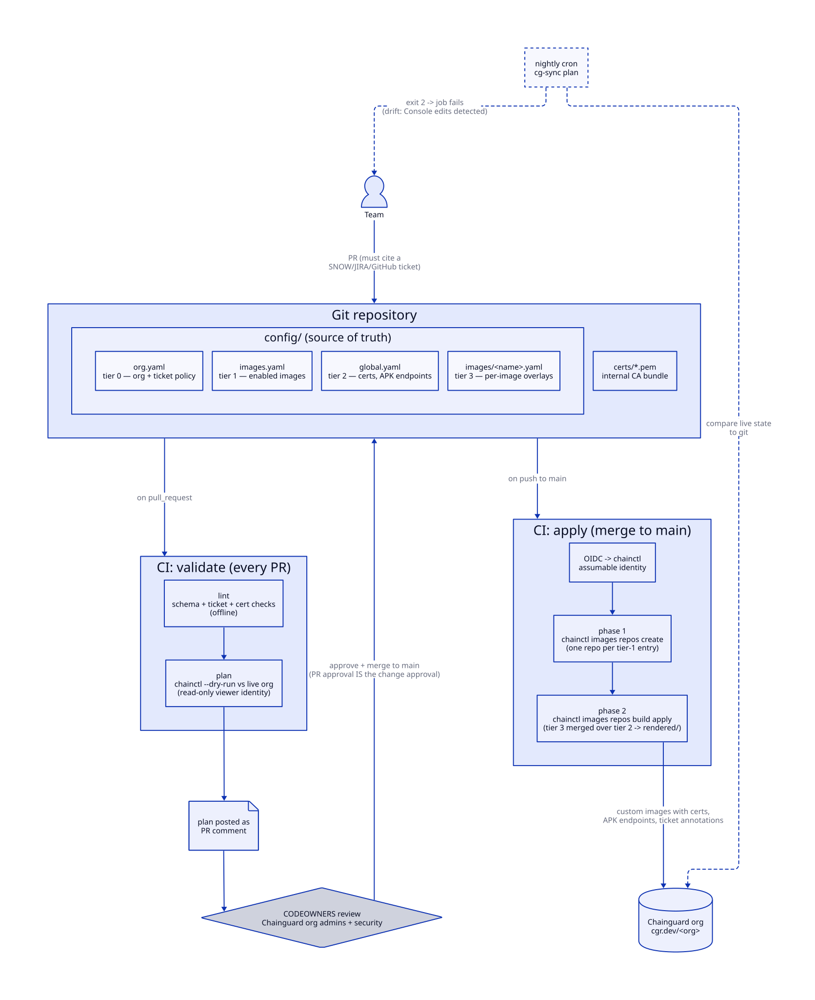

# Chainguard Image Governance (chainctl GitOps)

A vendor-neutral, ticket-governed GitOps workflow for managing your
organization's Chainguard image catalog with `chainctl` — for teams that
can't (or won't) use Terraform. Plain Python + YAML; runs identically from
GitHub Actions, Bitbucket Pipelines, Jenkins, cron, or a laptop.

## How it works



A team opens a ticket-linked PR against the tiered YAML config. CI lints
offline and posts a read-only `chainctl --dry-run` plan as a PR comment.
CODEOWNERS approve — the PR approval *is* the change approval. Merge to
`main` triggers `apply`: repo creation, then Custom Assembly builds (certs,
APK endpoints, packages, ticket annotations). A nightly plan run detects
drift, e.g. someone editing an image in the Console.

(Diagram source: [`docs/architecture.d2`](docs/architecture.d2); regenerate
with `make diagram`.)

## Quick start (10 minutes, laptop only)

Prerequisites: Python 3.10+, [`chainctl`](https://edu.chainguard.dev/chainguard/chainctl-usage/how-to-install-chainctl/),
and a Chainguard organization you can administer.

```sh
# 1. Get the code
git clone <this-repo> && cd chainctl-gitops-reference-arch
pip install -r requirements.txt          # PyYAML, the only dependency

# 2. Point it at YOUR org (edit the CHANGE ME lines)
$EDITOR config/org.yaml                  # org: <your-org>

# 3. List the images your org should have (repos that already exist
#    in your org are adopted as-is; missing ones get created)
$EDITOR config/images.yaml

# 4. See what would change — no writes yet
chainctl auth login
./bin/cg-sync lint                       # offline validation
./bin/cg-sync plan                       # dry-run diff vs your live org

# 5. Make it so
./bin/cg-sync apply
```

Exit codes: `0` in sync, `1` error, `2` (plan only) changes pending.

When you're happy with the local loop, wire up CI: **[docs/ci-setup.md](docs/ci-setup.md)**
walks through the OIDC identities (a write identity for `main`, a read-only
one for PRs), the exact role capabilities, and fixes for the two auth
errors you're most likely to hit. Until its two GitHub variables are set,
the workflows skip cleanly.

## Guide 1 — enable an image for your org

Everything is a PR against one file.

1. Open a change ticket (JIRA / SNOW / GitHub issue).
2. Add the image to `config/images.yaml`:

   ```yaml
   images-enabled:
     - name: redis
       ticket: JIRA-4321
   ```

3. Open a PR. CI lints and posts the plan as a PR comment:
   `redis | repo | will create (ticket: JIRA-4321)`.
4. CODEOWNERS approve; merge. CI applies and the repo appears at
   `cgr.dev/<org>/redis`.

Tickets aren't just paperwork: `lint` fails without one, and the ticket is
baked into the image as an OCI annotation
(`com.acme.governance/change-ticket`), so any running container traces
back to its change record.

## Guide 2 — customize an image (python + jq, the worked example)

This repo ships the example live: [`config/images/python.yaml`](config/images/python.yaml)
adds `jq` to the `python` image.

1. Make sure the image is enabled (Guide 1) — `python` is in
   `config/images.yaml`.
2. Create an overlay named after the image, `config/images/python.yaml`:

   ```yaml
   image: python
   ticket: JIRA-2101          # the use-case that justifies it
   approved-by: platform-security

   customizations:
     packages:
       - jq                   # must exist in Chainguard's APK repo
   ```

3. PR → plan comment shows the exact package/env/annotation diff → approve
   → merge → CI runs `chainctl images repos build apply` with the merged
   config.

Options worth knowing:

- **Keep the base pristine** — add `save-as: python-tools` under
  `customizations:` and the enriched image is published as its own repo
  (`cgr.dev/<org>/python-tools`) while `python` stays untouched. Use this
  when only one team has the approved use-case.
- **Env vars and annotations** — `environment:` and `annotations:` maps
  merge the same way (`CHAINGUARD_*` env keys and `dev.chainguard*`
  annotation keys are reserved; `lint` rejects them).
- The merged config per image is rendered to `rendered/<image>.yaml` and
  uploaded as a CI artifact, so reviewers see the exact YAML sent to
  Chainguard.

## Guide 3 — add your internal CA certificates

Gets your corporate CA into the trust bundle of *every* enabled image, so
in-image tooling can talk to TLS-intercepting proxies and internal services.

> Beta feature — requires enrollment. Ask your Chainguard CS team to enable
> certificate support for your org first.

1. Drop your PEM files in [`certs/`](certs/) (public keys — safe to commit):

   ```
   certs/acme-root-ca.pem
   certs/acme-intermediate.pem
   ```

2. Reference them in `config/global.yaml`:

   ```yaml
   certificates:
     - certs/acme-root-ca.pem
     - certs/acme-intermediate.pem
   ```

3. PR → merge. Every image (minus any in `exclude:`) is rebuilt with the
   certs via `--with-certificates`. `lint` fails early if a referenced file
   is missing.

The same file carries the other org-wide baseline: `runtime-repositories:`
points images' `apk` at your artifact manager (entries **replace** the
default `virtualapk.cgr.dev` — list every endpoint you need, HTTPS only).

## Guide 4 — wire up CI

Follow **[docs/ci-setup.md](docs/ci-setup.md)**. Summary:

1. Enable the Chainguard Actions entitlement (the workflows use hardened,
   SHA-pinned action mirrors): `chainctl actions entitlements create --parent <org>`.
2. Create a least-privilege apply role + identity pinned to `main`, store
   as the `CHAINGUARD_IDENTITY` repo variable.
3. Create a read-only (viewer) identity for PR plan runs, store as
   `CHAINGUARD_PLAN_IDENTITY`.
4. Put real reviewer teams in `.github/CODEOWNERS`.

The guide includes fixes for the two errors you're most likely to see:
GitHub's ID-embedded OIDC subjects (`token has invalid subject`) and the
missing `groups.list` capability (`No folder found`).

## Reference

### The config tiers

| Tier | File | What it governs | chainctl command |
|---|---|---|---|
| 0 | `config/org.yaml` | Org name, ticket policy, concurrency, traceability annotations | — |
| 1 | `config/images.yaml` | Which images the org enables | `images repos create` |
| 2 | `config/global.yaml` | Org-wide baseline: CA certs, APK endpoints, org-wide packages | `images repos build apply` |
| 3 | `config/images/<image>.yaml` | Per-image, per-use-case customizations, optional `save-as:` variants | merged over tier 2, same `build apply` |

### Commands

```sh
./bin/cg-sync lint                     # offline: schema, tickets, cert files
./bin/cg-sync plan                     # dry-run vs live org (exit 2 = changes)
./bin/cg-sync apply                    # reconcile (parallel, non-interactive)
./bin/cg-sync apply --only python      # scope to one image
./bin/cg-sync report --output markdown # state report, flags unmanaged repos
```

`apply` runs phase 1 (repo creation) to completion first, then phase 2
(Custom Assembly builds); both fan out in parallel, bounded by
`defaults.concurrency` in `org.yaml`.

### Repo layout

```
config/
  org.yaml            tier 0 — org + policy settings (CHANGE ME lines)
  images.yaml         tier 1 — images-enabled list (ticket per image)
  global.yaml         tier 2 — certs, APK runtime repos, org-wide packages
  images/*.yaml       tier 3 — per-image overlays (python + jq example)
certs/                internal CA PEMs referenced by global.yaml
scripts/chainguard_sync.py   the tool (stdlib + PyYAML)
bin/cg-sync           bash entrypoint
.github/workflows/    validate (PR: lint + plan comment) + apply (merge/nightly)
docs/                 architecture diagram + CI/OIDC setup guide
examples/ci/          Bitbucket, Jenkins, cron adapters
rendered/             (gitignored) generated per-image configs
```

### Notes & caveats

- Custom Assembly **certificates are Beta** and require enrollment.
- Packages added in overlays must exist in Chainguard's APK repository
  (`chainctl` validates on apply; the PR plan surfaces failures early).
- `report` flags repos that exist in the org but aren't in `images.yaml` —
  useful when onboarding an org with pre-existing repos.
- The workflows are hardened: deny-by-default `permissions`, SHA-pinned
  [Chainguard Actions](https://edu.chainguard.dev/chainguard/actions/overview/)
  mirrors, no persisted checkout credentials, dispatch inputs passed via
  env vars, `pipefail` on all piped steps.
